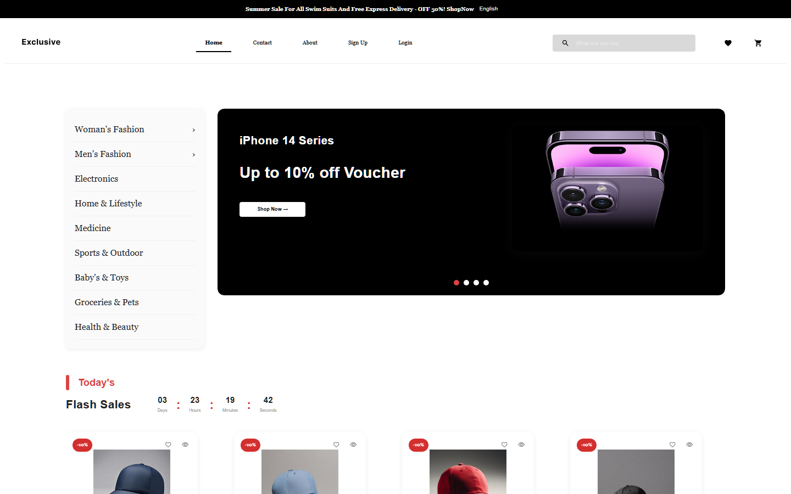

# Exclusive

An e-commerce store I built as the final project of the Sanad Youth frontend course (Aug–Oct 2025). It started as a small products dashboard exercise and grew into a full storefront with a catalog, cart, wishlist, and auth.

**Live demo:** https://exclusive-shop-app.vercel.app



## What it does

- Browse products with search suggestions and category filters — filters live in the URL (`?category=`), so filtered views are shareable links
- Cart with quantities and a live count badge in the navbar, persisted in localStorage so it survives a refresh
- Wishlist you can toggle from any product page, also persisted, with its own page and badge
- Login/signup forms validated with Yup
- Contact and billing forms reusing the same validation pattern
- Mobile-friendly: the navbar collapses into a drawer with compact cart/wishlist actions

## How it's built

React 19 + Vite, organized feature-first — each feature (`products`, `cart`, `wishlist`, `auth`, `home`...) owns its own `pages/`, `components/`, `hooks/`, `services/`, and `store/`.

- **TanStack React Query** for data fetching and caching — products come from the [escuelajs API](https://api.escuelajs.co) through a small Axios wrapper in `src/lib/axios`
- **Zustand** for cart and wishlist state, with small localStorage helpers for persistence
- **react-hook-form + Yup** for every form in the app
- **MUI** components with custom styles on top, lazy-loaded routes per feature with `react-router-dom`

## Run it locally

```bash
yarn install
yarn dev
```

Other scripts: `yarn build` (production build), `yarn preview`, `yarn lint`, and `yarn server` if you want the optional local mock API.

## Honest notes

The auth flow is a demo (no real session handling on a backend) and the wishlist only syncs locally. I've added **Vitest** and **React Testing Library** with unit and component tests (`yarn test`) and would expand coverage next. If the escuelajs API changes its schema, a couple of fields like `images` and `category.name` may need adjusting.
